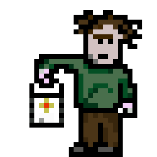
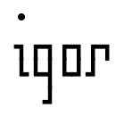

# Igor 



"Yeth, mathtur...! What ith thy bidding?"

## Description 



An automated AWS Caretaker, Igor does thy bidding by blowing the candles out at night and lighting the fires in the morning. He produces all the necessary ~~shavings~~ er, savings on costs...

With a mixture of front-end web interface and back-end comms scripts, Igor is able to keep a watch on your AWS estate and turn off the electric generators if calculatory activities are not requried.

---

## Operation

**Igor, clean up this mess!?**

---

## Deployment

**Igor, go forth and replicate thyself!**

---


## Instructions

**Igor, how in the name of Frankenstein do you work?**

### Configuring AWS connection

1. Create an IAM user for Igor and provide CLI access only.
2. Specify Permissions:
```
{
    "Version": "2012-10-17",
    "Statement": [
        {
            "Sid": "AutoStartStopPermissions",
            "Effect": "Allow",
            "Action": [
                "ec2:DescribeInstances",
                "ec2:StartInstances",
                "ec2:StopInstances"
            ],
            "Resource": "*"
        }
    ]
}
```
3. Add CLI keys to Igor's settings


### Setting up Schedules

### Adding instances to schedule groups

### Enabling automation

### Manual Control


---

## License

Licensed under GNU GPL v2, a copy of this is included [here](LICENSE)

Igor, an AWS automated Caretaker.
    Copyright (C) 2024  R. Trotter

    This program is free software; you can redistribute it and/or modify
    it under the terms of the GNU General Public License as published by
    the Free Software Foundation; either version 2 of the License, or
    (at your option) any later version.

    This program is distributed in the hope that it will be useful,
    but WITHOUT ANY WARRANTY; without even the implied warranty of
    MERCHANTABILITY or FITNESS FOR A PARTICULAR PURPOSE.  See the
    GNU General Public License for more details.

    You should have received a copy of the GNU General Public License along
    with this program; if not, write to the Free Software Foundation, Inc.,
    51 Franklin Street, Fifth Floor, Boston, MA 02110-1301 USA.
