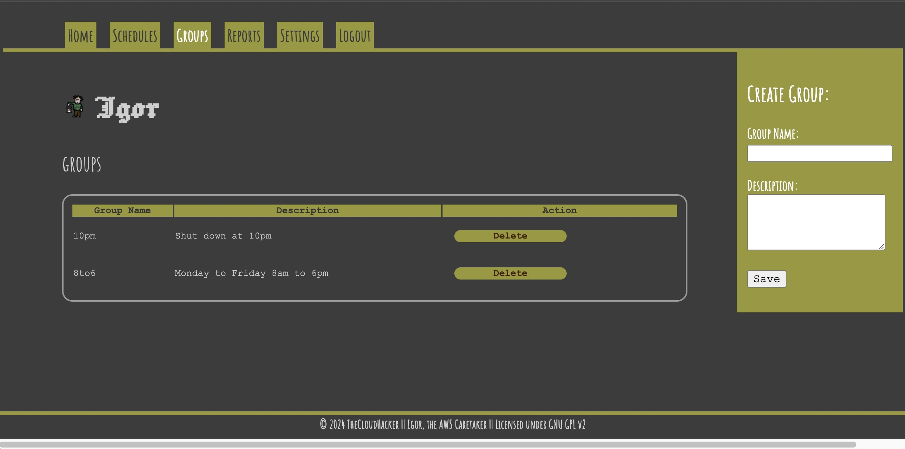
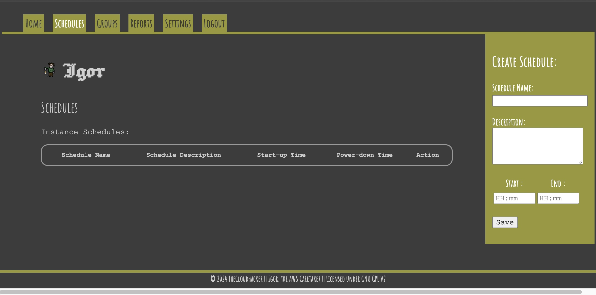

# Igor 


"Yeth, mathtur...! What ith thy bidding?"

## Description 

 An automated AWS Caretaker, Igor does thy bidding by blowing the candles out at night and lighting the fires in the morning. He produces all the necessary ~~shavings~~ er, savings on costs...

With a mixture of front-end web interface and back-end comms scripts, Igor is able to keep a watch on your AWS estate and turn off the electric generators if calculatory activities are not requried for the evening's scientific experiments.



---

## Operation

**Igor, clean up this mess!?**

EC2 instances are superbly useful and necessary in many environments, however they come with the downside of being excessively costly if left running ( especially if you've opted for huge resource requirements! ). 

By creating operational time zones and placing instances into groups you can start to control the power on and off activities and even set cut-off times for operation. Once you reach that time, Igor will send a signal to shut down the EC2 instances or power them back on ready for another day of work.



---

## Deployment

**Igor, go forth and replicate thyself!**

Igor is designed to be deployed in your own environment, be that your residential castle, your industrial complex or on the Planet-Wide Ether. 

Information on the deployment methods can be found in the [manuals section](./manuals/README.md) of the codebase.

### Development machine
Igor utilises Python and Flask to operate. Installation requirements for pip are stored in the requirements.txt file. To install those run: 

`pip install -r requirements.txt`

If you change and add to any of the libraries, be sure to add those to the requirements.txt file or run the following to set your requirements:

`pip freeze > requirements.txt`

Initialise and run the virtual environment:

If no virtual environment exists:  
```
cd igor
python3 -m venv .venv
```

Activate the environment with: `. .venv/bin/activate`

Run the application from the igor directory:

```
cd igor
python3 app.py
```

Rebuilding the Docker image:

`docker image build -t igor_docker .`


### Deployment of service

Igor can be deloyed locally for development testing or to dedicated resource.

Docker Launch:

`docker run -p 5000:5000 -d igor_docker`

---


## Instructions

**Igor, how in the name of Frankenstein do you work?**

### Configuring AWS connection

1. Create an IAM user for Igor and provide CLI access only.
2. Specify Permissions:
```
{
    "Version": "2012-10-17",
    "Statement": [
        {
            "Sid": "AutoStartStopPermissions",
            "Effect": "Allow",
            "Action": [
                "ec2:DescribeInstances",
                "ec2:StartInstances",
                "ec2:StopInstances"
            ],
            "Resource": "*"
        }
    ]
}
```
3. Add CLI keys to Igor's settings


### Setting up Schedules

Schedules must be generated first in order to set times for turning systems on/off.

### Adding instances to schedule groups

Once you have generated schedules, you can generate groups of instances 

### Enabling automation

Once you have groups of instanes assigned to schedules, you can turn the automation on or off using the web interface.

### Manual Control

You can manually operate tasks on a group by selecting the group and using the context menu to underake your operation.

---

## Back-End Services

Igor needs, as all good man servants do, a personal laboratory area to get things done. In order to blow the candles out and light them again, Igor needs the backend_processing.py to be fired-up every minute. If you have Igor deployed via Docker, this will have been set up for you in the background. If you are running from a local machine directly or installing it on a virtual/physical system then you will need to create a cron entry to launch the backend_processing.py instructions.

```
* * * * * python3 ./{path to Igor}/backend_processing.py
```

The backend processing uses the credentials for AWS that you have stored in the web interface.

---

## System Manuals
Information on how to run, deploy and develop Igor can be found in the [Manuals Section](./manuals/README.md) of the codebase. You can browse this here or by cloning the repository and viewing locally.

The Manuals provide a deeper understanding of the setup, development and operation of the system.

---

## License

Licensed under GNU GPL v2, a copy of this is included [here](LICENSE)

Igor, an AWS automated Caretaker.
    Copyright (C) 2024  R. Trotter

    This program is free software; you can redistribute it and/or modify
    it under the terms of the GNU General Public License as published by
    the Free Software Foundation; either version 2 of the License, or
    (at your option) any later version.

    This program is distributed in the hope that it will be useful,
    but WITHOUT ANY WARRANTY; without even the implied warranty of
    MERCHANTABILITY or FITNESS FOR A PARTICULAR PURPOSE.  See the
    GNU General Public License for more details.

    You should have received a copy of the GNU General Public License along
    with this program; if not, write to the Free Software Foundation, Inc.,
    51 Franklin Street, Fifth Floor, Boston, MA 02110-1301 USA.
